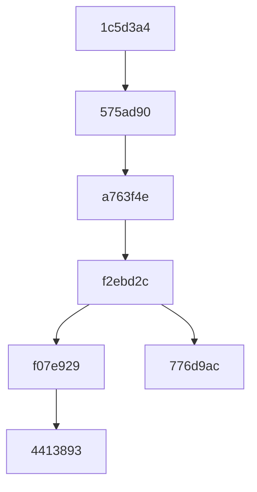

GIT REBASING
=============
```
 git branch
```

  
```
  git log --all --decorate --oneline --graph
```

  

```
                                                                                                   f07e929 (F1)<------4413893 (origin/Testing, Testing) (F1)
                                                                                                     /
  1c5d3a4 (first check in)<----- 575ad90 (origin/main) First commit->a763f4e(First Commit)<-------f2ebd2c (M1)<------------776d9ac (HEAD -> main, origin/main, origin/HEAD) M2
```


                                                     
CHECKOUT TESTING BRANCH
--------------------------

```
git checkout Testing   (Set Testing as working branch)
```


REBASE ON MASTER
----------------------

```

git rebase master     (Rebase feature (Testing)on to master,
                       moving  f07e929  on to main head 776d9ac 
                       in local repository)
                       
```

If you have to resolve the merge conflicts and continue rebasing. 


Git Status
----------------
 ```
 git status
 ```
 


```
Above output description stating that moving\lifting\re-basing testing branch 
from  **f2ebd2c**  on to **'776d9ac'** (New head of main\master) .

     rebase in progress; onto 776d9ac
     You are currently rebasing branch 'Testing' on '776d9ac'.
```
    
   

 

Git MergeTool
----------------
If you have to resolve the merge conflicts and continue rebasing.
Use any merge tool configure in your config or can directly goto respective file and adjust the code.

```
git mergetool
```


```
 M1
 <<<<<<< HEAD
 M2
 =======
 F1
 >>>>>>> F1

<<<<<<<<Head  Denotes  changes coming from main branch Head which is M2
>>>>>>>>> F1 denotes changes we made on feature branch (Testing) F1
 
 **Note**: Both main and Testing branch have M1 in rebase.txt at the time Testing branch branched off from Main
 
  After resolving rebase merging conflict code  as below save file  and  continue "git rebase --continue"

```
   
   

   

Git rebase --continue
---------------------
Resolve your conflict and continue

```
git  add .  (To add changes to staging)
git rebase --continue
```

Once rebasing continues and  completed below output displays
  
  
And on futher doing 


NOTE: At any stage, if you think you have made a mistake and want to reset your local branch with the current remote branch HEAD.
       This is when you haven't pushedd changes to remote branch 
```
git reset --hard origin/HEAD
 ```


UNDO GIT  REBASE
===================
Undo a git rebase


Say,you did a git rebase at your local branch but mistakenly rebased to an older branch and has been pushed changes to remote, 
then here is the way to revert your changes and go back to the previous state.

Take Back up all your changes.
Use git reflog to see all your previous operations. git log will show rebased and squashed changes only.

```
git reflog
```
Find the commit where you like to go back to. 
Most likely it will be a commit before your rebase operation. 
You will observe commit ids like HEAD@{4}.Now reset your local branch to this commit.
```
git reset --hard HEAD@{4}
```
This will  move only the local branch to HEAD@{4}

Now check the status of your local branch.

```
 git status
```

 On branch Testing
 Your branch and 'origin/Testing' have diverged 

This hint that your local branch and remote branch have diverged as your local branch has reverted back to a previous commit id 
while remote branch is still ahead.

To force your remote branch to go back to where your local branch is.

```
git push --force
```

At any stage, if you want to reset your local branch with the current remote branch HEAD,When rebsae is not pushed to master.

Do below

```
  git reset --hard origin/HEAD
```

